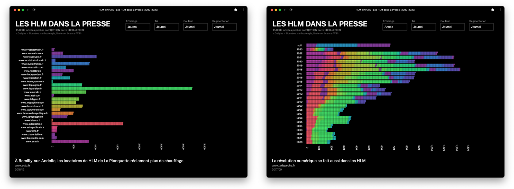

🚧 — v.0-alpha

# Les HLM dans la Presse (2000-2023 · 15K articles)

➤ [Accéder à la visualisation](https://charnould.github.io/hlm-papers/) · Chaque `carré` correspond à un article de presse.

## Méthodologie

1. Scraping des sites de Presse Quotidienne Nationale (`PQN`) et Presse Quotidienne Régionale (`PQR`) via :

- la page d'archives quotidiennes du site du journal ([exemple](https://actu.fr/archives/09-2022/07-09-2022/page/1))
- la fonctionnalité de recherche disponible sur le site du journal ([exemple](https://recherche.lefigaro.fr/recherche/logement/?type=ART&page=1))
- l'éventuelle `API` publiquement accessible (mais non documentée) qui alimente le site du journal ([exemple](https://www.lanouvellerepublique.fr/api/v1/search?&lang=fr&limit=10&query=hlm&predefinedFacets=))

2. Sauvegarde des articles dont le **titre** contient **au moins un** des syntagmes (insensibles à la casse et aux espaces) : `hlm`, `logement social`, `logements sociaux`, `bailleur social`, `bailleurs sociaux`, `action logement`, `1 % logement`.
3. Diverses manipulations des données (nettoyage, enrichissement, etc.)  
   L'unicité des articles est assurée par une contrainte d'unicité des `url`.
4. Visualisation des 15 000+ articles

## Principales limites

- Interrogation quant à l'exhaustivité de certains sites scrapés (ex : Le Télégramme)
- Des archives internet qui ne débutent pas systématiquement la même année selon les journaux
- Une sélection des articles sur la base de termes contenus **uniquement** dans **le titre**
- Un biais temporel évident : une publication moindre d'articles en 2000 qu'en 20xx
- Scraping de certains titres du Groupe Rossel La Voix non-effectué à ce stade :
  - https://www.courrier-picard.fr
  - https://www.lardennais.fr
  - https://www.paris-normandie.fr
  - https://www.lest-eclair.fr

## Principales bibliothèques utilisées

> Le code-source a été écrit sans souci de qualité et des meilleures pratiques (DRY).  
> Il est _juste_ fonctionnel.

- `Crawlee` (avec `Pupetteer` et `Cheerio`) pour le crawling et scraping
- `SQLite` pour la sauvegarde des données
- `sandDance` pour la visualisation

## Source des données (retenues sur la base de l'[APCM](https://www.acpm.fr))

> La base de données intégrale et enrichie (URL, snippet, article...) n'est pas - à ce jour - disponible dans ce répertoire  
> Elle le sera dans le futur.

**`PQN`, par ordre alphabétique**

- **Le Figaro** · https://www.lefigaro.fr

  - Scraping via la page de recherche
  - Pas de garantie d'exhaustivité

- **Le Monde** · https://www.lemonde.fr

  - Scraping des archives quotidiennes à partir de janvier 2000
  - A priori exhaustif

- **Libération** · https://www.liberation.fr
  - Scraping des archives quotidiennes à partir de février 2000
  - A priori exhaustif

**`PQR`, par ordre alphabétique**

- **Actu** · https://actu.fr

  - Scraping des archives quotidiennes à partir d'octobre 2000
  - A priori exhaustif

- **La Charente Libre** · https://www.charentelibre.fr

  - Scraping via la page de recherche, jour par jour
  - Pas de garantie d'exhaustivité

- **La Dépéche du Midi** · https://www.ladepeche.fr

  - Scraping des archives quotidiennes à partir de janvier 2000
  - A priori exhaustif

- **La Montagne** · https://www.lamontagne.fr

  - Scraping des archives quotidiennes à partir de juin 2009
  - A priori exhaustif

- **La Nouvelle République** · www.lanouvellerepublique.fr

  - Scraping direct de leur `API`, jour par jour, depuis 2000
  - A priori exhaustif

- **La Provence** · https://www.laprovence.com

  - Scraping via la page de recherche
  - Pas de garantie d'exhaustivité

- **La République du Centre** · https://www.larep.fr

  - Scraping via la page de recherche, jour par jour, partir de juin 2009
  - Pas de garantie d'exhaustivité

- **La Voix du Nord** · https://www.lavoixdunord.fr

  - Scraping des archives quotidiennes à partir de janvier 2015
  - A priori exhaustif

- **L'Alsace** · https://www.lalsace.fr

  - Scraping des archives quotidiennes à partir de janvier 2018
  - A priori exhaustif

- **Le Berry Républicain** · https://www.leberry.fr

  - Scraping via la page de recherche, jour par jour, partir de juin 2009
  - Pas de garantie d'exhaustivité

- **Le Bien Public** · https://www.bienpublic.com

  - Scraping des archives quotidiennes à partir de janvier 2018
  - A priori exhaustif

- **Le Dauphiné** · https://www.ledauphine.com

  - Scraping des archives quotidiennes à partir de janvier 2018
  - A priori exhaustif

- **Les Dernières Nouvelles d'Alsace** · https://www.dna.fr

  - Scraping des archives quotidiennes à partir de janvier 2018
  - A priori exhaustif

- **Le Télégramme** · https://www.letelegramme.fr

  - Scraping du fichier `json` généré par leur fonction de recherche
  - Pas de garantie d'exhaustivité

- **Le Journal du Centre** · https://www.lejdc.fr

  - Scraping via la page de recherche, jour par jour, partir de juin 2009
  - Pas de garantie d'exhaustivité

- **Le Journal de Saone et Loire** · https://www.lejsl.com

  - Scraping des archives quotidiennes à partir de janvier 2018
  - A priori exhaustif

- **Le Midi Libre** · https://www.midilibre.fr

  - Scraping des archives quotidiennes à partir de janvier 2011
  - A priori exhaustif

- **Le Parisien** · https://www.leparisien.fr

  - Scraping des archives quotidiennes à partir de mars 2000
  - A priori exhaustif

- **Le Populaire** · https://www.lepopulaire.fr

  - Scraping via la page de recherche, jour par jour, partir de juin 2009
  - Pas de garantie d'exhaustivité

- **Le Progrès** · https://www.leprogres.fr

  - Scraping des archives quotidiennes à partir de janvier 2018
  - A priori exhaustif

- **Le Républicain Lorrain** · https://www.republicain-lorrain.fr

  - Scraping des archives quotidiennes à partir de janvier 2018
  - A priori exhaustif

- **L'Echo Républicain** · https://www.lechorepublicain.fr

  - Scraping via la page de recherche, jour par jour, partir de juin 2009
  - Pas de garantie d'exhaustivité

- **L'Est Républicain** · https://www.estrepublicain.fr

  - Scraping des archives quotidiennes à partir de janvier 2018
  - A priori exhaustif

- **L'Indépendant** · https://www.lindependant.fr

  - Scraping des archives quotidiennes à partir de janvier 2011
  - A priori exhaustif

- **L'Yonne Républicain** · https://www.lyonne.fr

  - Scraping via la page de recherche, jour par jour, partir de juin 2009
  - Pas de garantie d'exhaustivité

- **Nice Matin** · https://www.nicematin.com

  - Scraping via la page de recherche
  - Pas de garantie d'exhaustivité

- **Ouest-France** · https://www.ouest-france.fr (et ses déclinaisons : Maine Libre et Presse-ocean ?)

  - Scraping des archives quotidiennes à partir de janvier 2012
  - A priori exhaustif

- **Sud-Ouest** · https://www.sudouest.fr

  - Scraping du `sitemap` mensuel depuis 2010
  - A priori exhaustif

- **Var Matin** · https://www.varmatin.com

  - Scraping via la page de recherche
  - Pas de garantie d'exhaustivité

- **Vosges Matin** · https://www.vosgesmatin.fr
  - Scraping des archives quotidiennes à partir de janvier 2018
  - A priori exhaustif

## TODO

- [x] Ecrire un script qui permet de mettre à jour la BDD des nouveaux articles pertinents parus
- [x] (partiellement) Ecrire un script qui corrige et augmente la BDD (ex : anomalie d'`URL`, segmentation calendaire, etc.)
- [ ] Terminer le scraping des sites de presse manquants
- [ ] Mettre en place un algorithme `NLP` pour classifier les articles par `topic`, `sentiment` et `localisation`

## Licence

Le code-source est sous licence MIT, le contenu, les données et les illustrations sous licence CC BY SA 4.0.
Copyright © 2023 Charles-Henri ARNOULD — contact@beckrel.com
